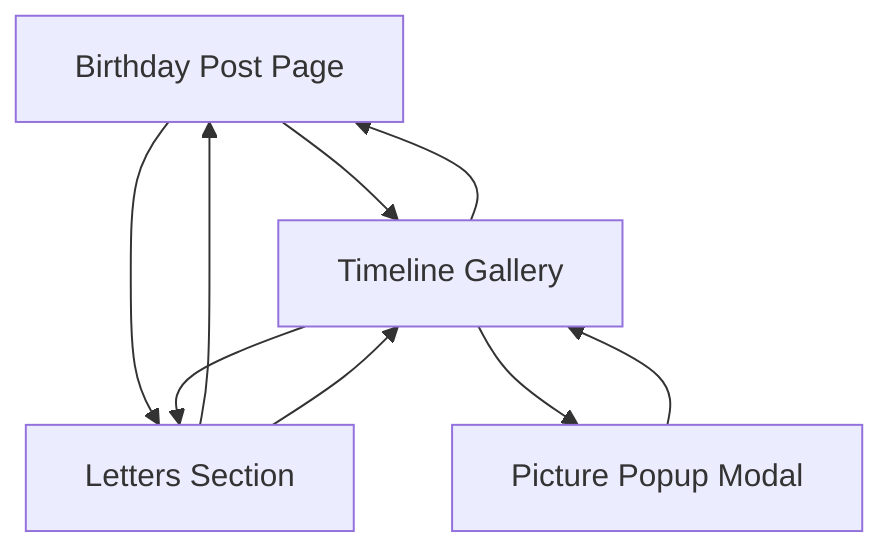

# Personalized Gift Website - Product Requirements Document

## 1. Product Overview
A personalized static website designed as a romantic gift, featuring three distinct sections to showcase memories, birthday celebrations, and personal letters. The website will serve as a digital scrapbook with an aesthetic lofi papery design, optimized for both desktop and mobile viewing and hosted on GitHub Pages.

## 2. Core Features

### 2.1 User Roles
No user authentication required - this is a static gift website with public access.

### 2.2 Feature Module
Our personalized gift website consists of the following main pages:
1. **Birthday Post**: hero section with framed picture, annotation description below frame.
2. **Timeline Gallery**: scrollable picture timeline, polaroid-style frames with dates, popup descriptions on click.
3. **Letters Section**: collection of personal letters, readable format with papery aesthetic.

### 2.3 Page Details

| Page Name | Module Name | Feature description |
|-----------|-------------|---------------------|
| Birthday Post | Hero Frame | Display single framed birthday picture with elegant border styling |
| Birthday Post | Annotation | Show descriptive text below the framed picture in handwritten style |
| Timeline Gallery | Picture Grid | Display scrollable timeline of pictures arranged vertically with scattered positioning |
| Timeline Gallery | Polaroid Frames | Style each picture with polaroid-like frame including date engraving |
| Timeline Gallery | Popup Modal | Show animated popup with picture description when image is clicked |
| Letters Section | Letter Display | Present personal letters in readable format with papery background |
| Letters Section | Letter Navigation | Allow browsing through multiple letters with smooth transitions |
| Navigation Bar | Tab Switching | Provide simple top navigation between the three main sections |
| Navigation Bar | Smooth Animations | Implement aesthetic transitions when switching between tabs |

## 3. Core Process

**Main User Flow:**
Users land on the birthday post page, can navigate between the three tabs using the top navigation bar. In the timeline section, they can scroll through memories and click on pictures to view detailed descriptions. The letters section allows reading through personal messages.

## 4. User Interface Design

### 4.1 Design Style
- **Primary Colors**: Warm cream (#F5F5DC), soft brown (#D2B48C), muted gold (#DAA520)
- **Secondary Colors**: Light gray (#F8F8FF), vintage white (#FFFDD0)
- **Typography**: Times New Roman family, 16px base size, serif styling
- **Button Style**: Rounded corners with subtle shadow, papery texture
- **Layout Style**: Card-based design with vintage paper textures, centered content
- **Animation Style**: Smooth fade transitions, gentle hover effects, soft popup animations
- **Icon Style**: Minimalist line icons with vintage aesthetic

### 4.2 Page Design Overview

| Page Name | Module Name | UI Elements |
|-----------|-------------|-------------|
| Birthday Post | Hero Frame | Large centered frame with ornate border, drop shadow, vintage styling |
| Birthday Post | Annotation | Elegant typography below frame, italic styling, centered alignment |
| Timeline Gallery | Picture Grid | Scattered vertical layout, masonry-style positioning, smooth scrolling |
| Timeline Gallery | Polaroid Frames | White borders with bottom text area, subtle rotation, vintage shadows |
| Timeline Gallery | Popup Modal | Centered overlay with fade-in animation, blurred background, close button |
| Letters Section | Letter Display | Paper-like background texture, handwritten font styling, comfortable reading spacing |
| Navigation Bar | Tab Menu | Simple horizontal layout, underline active state, smooth hover transitions |

### 4.3 Responsiveness
Mobile-first responsive design with desktop enhancements. Touch-optimized interactions for mobile devices, with larger tap targets and swipe gestures for navigation. Adaptive layouts that stack vertically on smaller screens while maintaining the aesthetic appeal.