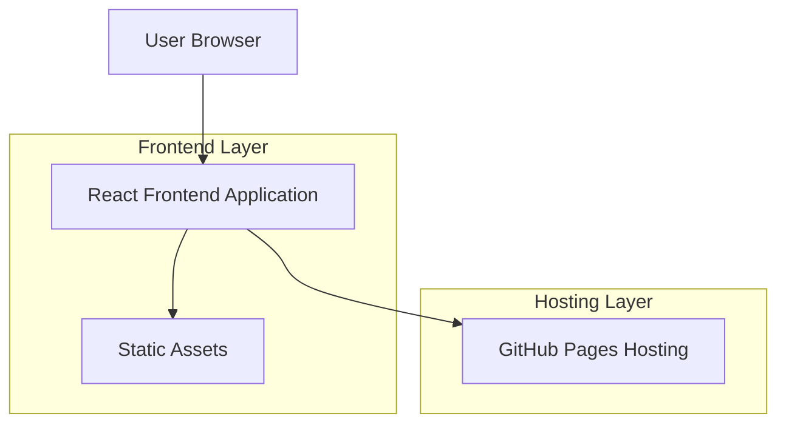

# Personalized Gift Website - Technical Architecture Document

## 1. Architecture Design



## 2. Technology Description

* Frontend: React\@18 + CSS3 + Vite

* Styling: CSS Modules + Custom CSS animations

* Build Tool: Vite for fast development and optimized production builds

* Hosting: GitHub Pages (static hosting)

* Assets: Local image storage with placeholder images

## 3. Route Definitions

| Route     | Purpose                                                               |
| --------- | --------------------------------------------------------------------- |
| /         | Birthday post page - main landing with framed picture and annotation  |
| /timeline | Timeline gallery page - scrollable picture timeline with popup modals |
| /letters  | Letters section page - personal letters display with navigation       |

## 4. Component Architecture

### 4.1 Core Components

**App Component Structure:**

```
App
├── Navigation
├── BirthdayPost
│   ├── HeroFrame
│   └── Annotation
├── TimelineGallery
│   ├── PictureGrid
│   ├── PolaroidFrame
│   └── PopupModal
└── LettersSection
    ├── LetterDisplay
    └── LetterNavigation
```

### 4.2 State Management

**Application State:**

| State Name      | Type    | Description                                            |
| --------------- | ------- | ------------------------------------------------------ |
| activeTab       | string  | Current active tab ('birthday', 'timeline', 'letters') |
| selectedPicture | object  | Currently selected picture for popup modal             |
| currentLetter   | number  | Index of currently displayed letter                    |
| isModalOpen     | boolean | Controls popup modal visibility                        |

### 4.3 Data Structure

**Picture Object:**

```typescript
interface Picture {
  id: string;
  src: string;
  alt: string;
  date: string;
  description: string;
  position: { x: number; y: number };
}
```

**Letter Object:**

```typescript
interface Letter {
  id: string;
  title: string;
  content: string;
  date: string;
}
```

## 5. Styling Architecture

### 5.1 CSS Organization

```
src/
├── styles/
│   ├── globals.css (base styles, typography)
│   ├── variables.css (color palette, spacing)
│   ├── animations.css (transition effects)
│   └── components/
│       ├── Navigation.module.css
│       ├── BirthdayPost.module.css
│       ├── TimelineGallery.module.css
│       └── LettersSection.module.css
```

### 5.2 Animation Implementation

* CSS transitions for tab switching

* Transform animations for picture hover effects

* Fade-in/fade-out for modal popups

* Smooth scrolling for timeline navigation

## 6. Asset Management

### 6.1 Image Handling

* Placeholder images stored in `public/images/` directory

* Optimized image formats (WebP with JPEG fallback)

* Responsive image loading with different sizes for mobile/desktop

### 6.2 Font Integration

* Times New Roman as primary font family

* Web-safe font stack with serif fallbacks

* Custom font weights for different text elements

## 7. Build and Deployment

### 7.1 Development Setup

```bash
npm create vite@latest . -- --template react
npm install
npm run dev
```

### 7.2 GitHub Pages Deployment

* Build command: `npm run build`

* Deploy directory: `dist/`

* GitHub Actions workflow for automatic deployment

* Custom domain support (optional)

### 7.3 Performance Optimization

* Code splitting for different page components

* Image lazy loading for timeline gallery

* CSS minification and bundling

* Tree shaking for unused code elimination

## 8. Responsive Design Implementation

### 8.1 Breakpoints

```css
/* Mobile First Approach */
@media (min-width: 768px) { /* Tablet */ }
@media (min-width: 1024px) { /* Desktop */ }
@media (min-width: 1440px) { /* Large Desktop */ }
```

### 8.2 Mobile Optimizations

* Touch-friendly button sizes (minimum 44px)

* Swipe gestures for timeline navigation

* Optimized image sizes for mobile bandwidth

* Simplified navigation for smaller screens

